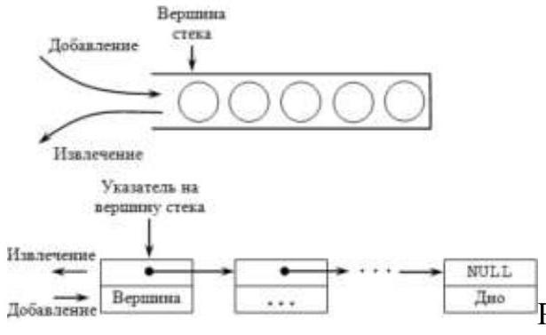
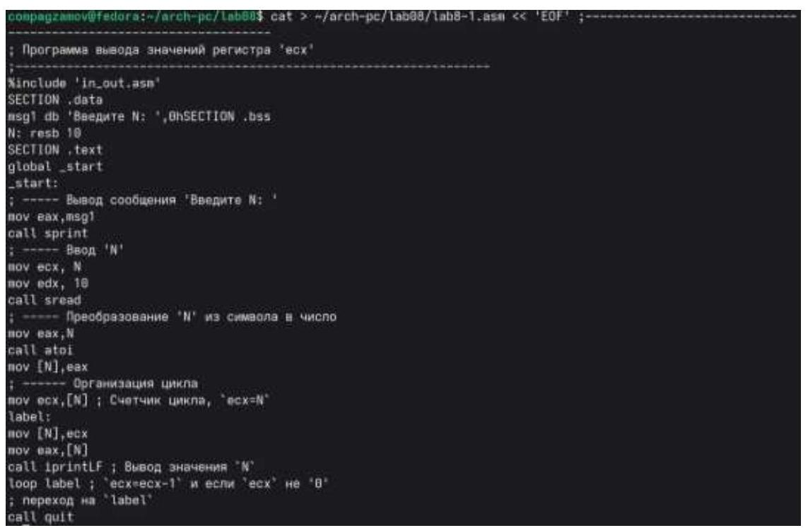
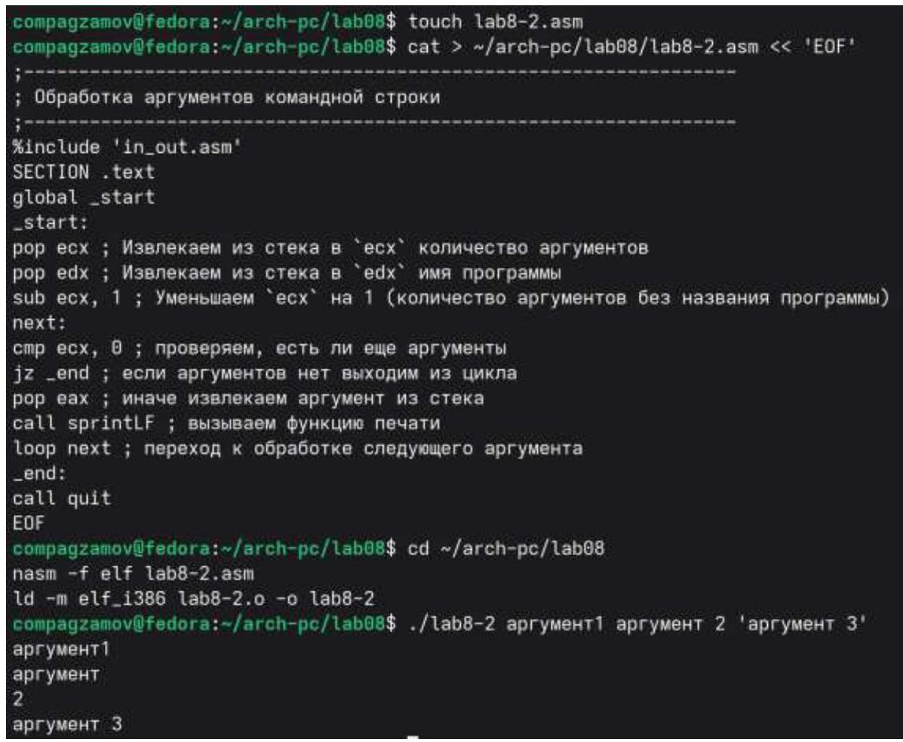
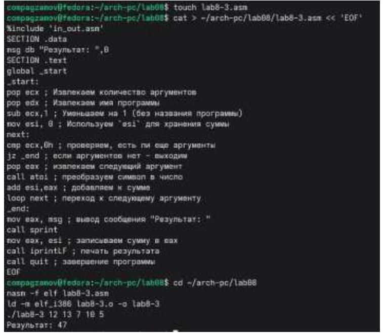
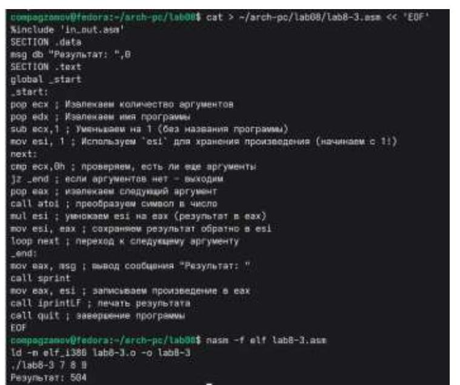
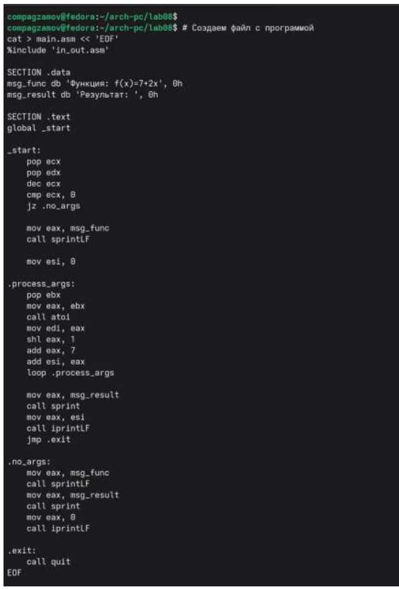
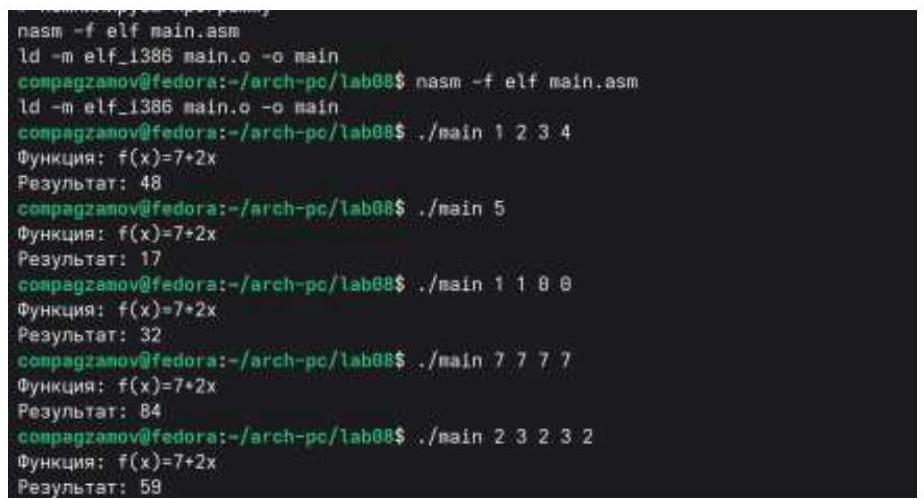

# РОССИЙСКИЙ УНИВЕРСИТЕТ ДРУЖБЫ НАРОДОВ 

Факультет физико-математических и естественных наук
Кафедра прикладной информатики и теории вероятностей

## Отчет по лабораторной работе №8

дисциплина: Архитектура ЭВМ

Студент: Агзамов Артур Дамирович(1032253528)
Группа: НКАбд-01-25

# Содержание 

1. Цель работы 
2. Теоретическое введение 
3. Выполнение лабораторной работы 
4. Выполнение самостоятельной работы 
5. Выводы 

# 1.Цель работы 

Приобретение навыков написания программ с использованием циклов и обработкой аргументов командной строки.

# 2. Теоретическое введение 

## 2.1. Организация стека

Стек - это структура данных, организованная по принципу LIFO («Last In — First Out» или «последним пришёл — первым ушёл»). Стек является частью архитектуры процессора и реализован на аппаратном уровне. Для работы со стеком в процессоре есть специальные регистры (ss, bp, sp) и команды. Основной функцией стека является функция сохранения адресов возврата и передачи аргументов при вызове процедур. Кроме того, в нём выделяется память для локальных переменных и могут временно храниться значения регистров. На рис. 8.1 показана схема организации стека в процессоре. Стек имеет вершину, адрес последнего добавленного элемента, который хранится в регистре еsp (указатель стека). Противоположный конец стека называется дном. Значение, помещённое в стек последним, извлекается первым. При помещении значения в стек указатель стека уменьшается, а при извлечении - увеличивается. Для стека существует две основные операции: $\cdot$ добавление элемента в вершину стека (push); $\cdot$ извлечение элемента из вершины стека (pop).

### 2.1.1. Добавление элемента в стек.

Команда push размещает значение в стеке, т.е. помещает значение в ячейку памяти, на которую указывает регистр еsp, после этого значение регистра еsp увеличивается на 4. Данная команда имеет один операнд - значение, которое необходимо поместить в стек.

Примеры:


Рис. 8.1. Организация стека в процессоре

push -10 ; Поместить -10 в стек
push ebx ; Поместить значение регистра ebx в стек
push [buf] ; Поместить значение переменной buf в стек
push word [ax] ; Поместить в стек слово по адресу в ах
Существует ещё две команды для добавления значений в стек. Это команда pusha, которая помещает в стек содержимое всех регистров общего назначения в следующем порядке: ax, cx, dx, bx, sp, bp, si, di. А также команда pushf, которая служит для перемещения в стек содержимого регистра флагов. Обе эти команды не имеют операндов.

# 2.1.2. Извлечение элемента из стека. 

Команда рор извлекает значение из стека, т.е. извлекает значение из ячейки памяти, на которую указывает регистр еsp, после этого уменьшает значение регистра еsp на 4. У этой команды также один операнд, который может быть регистром или переменной в памяти. Нужно помнить, что извлечённый из стека элемент не стирается из памяти и остаётся как "мусор", который будет перезаписан при записи нового значения в стек. Примеры:

## pop eax ; Поместить значение из стека в регистр еax

pop [buf] ; Поместить значение из стека в buf
pop word[si] ; Поместить значение из стека в слово по адресу в sі
Аналогично команде записи в стек существует команда рора, которая восстанавливает из стека все регистры общего назначения, и команда popf для перемещения значений из вершины стека в регистр флагов.

## 2.2. Инструкции организации циклов

Для организации циклов существуют специальные инструкции. Для всех инструкций максимальное количество проходов задаётся в регистре есх. Наиболее простой является инструкция loop. Она позволяет организовать безусловный цикл,

типичная структура которого имеет следующий вид:

```
mov ecx, 100 ; Количество проходов
NextStep:
```

$\qquad$
$\qquad$ ; тело цикла
$\qquad$
Loop NextStep ; Повторить `есх` раз от метки NextStep

Иструкция loop выполняется в два этапа. Сначала из регистра есх вычитается единица и его значение сравнивается с нулём. Если регистр не равен нулю, то выполняется переход к указанной метке. Иначе переход не выполняется и управление передаётся команде, которая следует сразу после команды loop.

# 3.Выполнение лабораторной работы 

## 3.1. Реализация циклов в NASM

Создали каталог для программам лабораторной работы № 8 , перешли в него и далее создали файл lab8-1.asm:

```
compagzamov@fedora:~$ mkdir ~/arch-pc/lab08
compagzamov@fedora:~$ cd ~/arch-pc/lab08
compagzamov@fedora:~/arch-pc/lab08$ touch lab8-1.asm
compagzamov@fedora:~/arch-pc/lab08$
```


## Puc. 8.2. lab01

При реализации циклов в NASM с использованием инструкции loop необходимо помнить о том, что эта инструкция использует регистр есх в качестве счетчика и на каждом шаге уменьшает его значение на единицу. В качестве примера рассмотрели программу, которая выводит значение регистра есх. Внимательно изучили текст программы (Листинг 8.1) и ввели его в файл lab8-1.asm.


Puc. 8.3. lab02

Сохранили файл и проверили его работу: работа корректна.

```
compagzamov@fedora:~/arch-pc/lab08$ co ~/arch-pc/lab08
nasm -f elf lab8-1.asm
ld -m elf_i386 lab8-1.o -o lab8-1
./lab8-1
Введите N: 7
1
2
3
4
5
6
7
```

Puc. 8.4. lab03
Изменили текст программы, добавив изменение значение регистра есх в цикле.

```
compagzamov@fedora:~/arch-pc/lab08$ cat > ~/arch-pc/lab08/lab8-1.asm << 'EOF'
Sinclude 'in_out.asm'
SECTION .data
msg: DB 'Введите N: ',0
SECTION .bss
N: RESB 10
SECTION .text
GLOBAL _start
_start:
mov eax, msg
call sprint
mov eax, N
call sread
mov eax, N
call atoi
mov ecx, eax
mov eax, 0
Label:
sub ecx,1 ; `ecx=ecx-1` - ИЗМЕНЕНИЕ ЕСX В ТЕЛЕ ЦИКЛА
mov [N],ecx
mov eax,[N]
call iprintLF
loop label ; ЗТО ПРИВЕДЕТ К НЕКОРРЕКТНОЙ РАБОТЕ!
call quit
EOF
compagzamov@fedora:~/arch-pc/lab08$ cd ~/arch-pc/lab08
nasm -f elf lab8-1.asm
ld -m elf_i386 lab8-1.o -o lab8-1
./lab8-1
Введите N: 6
5
5
compagzamov@fedora: /arch-pc/lab08$
```

Puc. 8.5. lab04

Теперь из-за того, что регистр есх на каждой итерации уменьшается на два значения, количество итераций уменьшается вдвое.

Добавили команды push и рор в программу, и теперь количество итераций совпадает введённому N, но произошло смещение выводимых чисел на -1.

```
compagzamov@fedora: /arch-pc/lab00$ cat > /arch-pc/lab08/lab8-1.asm << 'EOF'
%include 'in_out.asm'
SECTION .data
msg: DB 'Введите N: ',0
SECTION .bss
N: RESB 10
SECTION .text
GLOBAL _start
_start:
mov eax, msg
call sprint
mov eax, N
call sread
mov eax, N
call atoi
mov ecx, eax
mov eax, 0
label:
push ecx ; COXPAHREM ECX B CTEK
sub ecx,1
mov [N],ecx
mov eax,[N]
call iprintLF
pop ecx ; ВОССТАНАВЛИВАЕМ ЕСХ ИЗ СТЕКА
loop label
call quit
EOF
compagzamov@fedora: /arch-pc/lab00$ cd /arch-pc/lab08
nasm -f elf lab8-1.asm
ld -m elf_i386 lab8-1.o -o lab8-1
./lab8-1
Введите N: 8
7
6
5
4
3
2
1
0
```

Puc. 8.6. lab05

# 3.2. Обработка аргументов командной строки 

Создали файл lab8-2.asm в каталоге /arch-pc/lab08 и введите в него текст программы из листинга 8.2. Создали исполняемый файл и запустили его, указав аргументы: аргумент1 аргумент 2 'аргумент 3'. Было обработано 4 аргумента, ибо Пробелы делят аргументы на 4, но при этом, можно использоват пробелы внутри отдельных аргументов, используя фигурные скобки.


Puc. 8.7. lab06

Рассмотрели еще один пример программы которая выводит сумму чисел, которые передаются в программу как аргументы. Создали файл lab8-3.asm в каталоге $\sim / \operatorname{arch}-\mathrm{pc} / \mathrm{lab} 08$ и ввели в него текст программы из листинга 8.3.

Создали исполняемый файл и запустили его, указав аргументы. Пример результата работы программы:


Puc. 8.8. lab07
Изменили текст программы из листинга 8.3 для вычисления произведения аргументов командной строки.


Puc. 8.9. lab08

# 4. Выполнение самостоятельной работы 

Написали программу, которая находит сумму значений функции $f(x)$ для $x=x 1$, $x 2, \ldots, x n$, т.е. программа должна выводить значение $f(x 1)+f(x 2)+\ldots+f(x n)$. Значения $x i$ передаются как аргументы. Вид функции $f(x)$ выбрали из таблицы 8.1 вариантов заданий в соответствии с вариантом, полученным при выполнении лабораторной работы № 7(вариант 8: 7+2x)


Puc. 8.10. sam01

Создали исполняемый файл и проверили его работу на нескольких наборах $x=x 1$, $x 2, \ldots, x n$.


Puc. 8.11. sam02

Совершили проверку с различными значениями, и все окончательные выводы оказались правильными.

# 5.Выводы 

## В ходе лабораторной работы были приобретены практические навыки написания программ на языке ассемблера NASM с использованием циклов и обработкой аргументов командной строки. Были изучены следующие ключевые аспекты:

## 1. Работа команды loop

Команда loop использует регистр ЕСХ в качестве счетчика циклов. При выполнении команды значение ЕСХ автоматически уменьшается на 1, после чего производится проверка - если ЕСХ не равен нулю, выполняется переход на указанную метку. Это позволяет компактно организовывать циклы с фиксированным количеством итераиий.

## 2. Организация циклов через условные переходы

Альтернативный способ создания циклов без использования loop involves применение команд арифметики и условных переходов. Например, конструкиия dec ecx followed by jnz метка обеспечивает аналогичную функииональность, но предоставляет большую гибкость, позволяя использовать различные условия выхода из цикла и любые регистры в качестве счетчиков.

## 3. Определение стека

Стек представляет собой структуру данных типа LIFO (Last-In-First-Out), где последний добавленный элемент извлекается первым. В архитектуре х86 стек реализован как область памяти с динамическим указателем вершины стека (ESP/RSP), которая растет в сторону младших адресов.

## 4. Механизм выборки данных из стека

Выборка данных из стека осуществляется в строгом соответствии с приниипом LIFO. Команда push сохраняет данные в стек, уменьшая указатель стека, а команда рор извлекает данные, увеличивая указатель. Такой подход гарантирует, что последний сохраненный элемент будет извлечен первым, что критически важно для корректного управления данными и адресами возврата при вызовах функиий.

