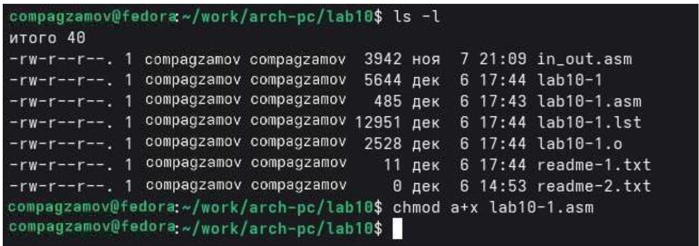

РОССИЙСКИЙ УНИВЕРСИТЕТ ДРУЖБЫ НАРОДОВ

Факультет физико-математических и естественных наук

Кафедра прикладной информатики и теории вероятностей

Отчет по лабораторной работе №10

дисциплина: Архитектура ЭВМ

Студент: Агзамов Артур Дамирович(1032253528)

Группа: НКАбд-01-25


Содержание

1. Цель работы 
2. Теоретическое введение 
3. Выполнение лабораторной работы
4. Выполнение самостоятельной работы 
5. Выводы стр.15


# Список иллюстраций

1. Рис. 1 
2. Рис. 2 
3. Рис. 3 
4. Рис. 4 
5. Рис. 5 
6. Рис. 6 
7. Рис. 7
8. Рис. 8 
9. Рис. 9 
10. Рис. 10 
11. Рис. 11 
12. Рис. 12 
13. Рис. 13 
14. Рис. 14 
15. Рис. 15 
16. Рис. 16 
17. Рис. 17 
18. Рис. 18 
19. Рис. 19 
20. Рис. 20 
21. Рис. 21 
22. Рис. 22 
23. Рис. 23 
24. Рис. 24 


1. Цель работы

Приобретение навыков написания программ для работы с файлами.


## 2. Теоретическое введение

Операционная система GNU/Linux является многопользовательской.

Для защиты данных каждого пользователя от несанкционированного доступа со стороны других пользователей в системе предусмотрены механизмы разграничения прав доступа к файлам и каталогам.

Эти механизмы не только ограничивают доступ, но и позволяют настраивать разрешения для совместной работы с данными — например, предоставлять доступ к файлам отдельным пользователям или группам пользователей.

Таким образом, система безопасности Linux обеспечивает как конфиденциальность данных пользователей, так и гибкие возможности для коллективного использования ресурсов.


# 3. Выполнение лабораторная работы

Создадим каталог для программам лабораторной работы № 10, перейдем в него и создадим файлы lab10-1.asm, readme-1.txt и readme-2.txt (рисунок 1)

```bash
compagzamov@fedora:~$ mkdir ~/work/arch-pc/lab10
compagzamov@fedora:~$ cd ~/work/arch-pc/lab10
```

Рисунок 1

```bash
compagzamov@fedora:~/work/arch-pc/lab10$ touch lab10-1.asm readme-1.txt readme-2.txt
compagzamov@fedora:~/work/arch-pc/lab10$ gedit lab10-1.asm
```

Рисунок 2

Введем в файл lab10-1.asm текст программы из листинга (рисунок 2-3)


```batch
#include 'in.out.asm'
SECTION .data
filename db 'readme-1.txt', 8h
msg db 'Введите строку для записи в файл: ', 8h
SECTION .bss
contents resb 255
SECTION .text
global _start
_starti
mov eax, msg
call sprint
mov ecx, contents
mov edx, 255
call sread
mov ecx, 2
mov ebx, filename
mov eax, 5
int 88h
mov esi, eax
mov eax, contents
call slen
mov edx, eax
mov ecx, contents
mov ebx, esi
mov eax, 4
int 88h
mov ebx, esi
mov eax, 6
```

```txt
int 88h
call quit
```

Рисунок 3

Создадим исполняемый файл и проверим его работу(рисунки 4,5,6,7,8)

```shell
compagzamov@fedor&lt;~/work/arch-pc/lab18$ nasm -f elf -g -l lab18-1.lst lab18-1.asm
compagzamov@fedor&lt;~/work/arch-pc/lab18$
```

Рисунок 4

```batch
compagzamov@fedor&lt;~/work/arch-pc/lab18$ ld -m elf_i386 -o lab18-1 lab18-1.o
compagzamov@fedor&lt;~/work/arch-pc/lab18$
```

Рисунок 5


```txt
compagzamov@fedora:~/work/arch-pc/lab10$ ./lab10-1
Введите строку для записи в файл: compagzamov
```

## Рисунок 6

```txt
compagzamov@fedora:~/work/arch-pc/lab10$ ls -l
итого 40
-rw-r--r--. 1 compagzamov compagzamov 3942 ноя 7 21:09 in_out.asm
-rwxr-xr-x. 1 compagzamov compagzamov 5644 дек 6 17:44 lab10-1
-rw-r--r--. 1 compagzamov compagzamov 485 дек 6 17:43 lab10-1.asm
-rw-r--r--. 1 compagzamov compagzamov12951 дек 6 17:44 lab10-1.lst
-rw-r--r--. 1 compagzamov compagzamov 2528 дек 6 17:44 lab10-1.o
-rw-r--r--. 1 compagzamov compagzamov 11 дек 6 17:44 readme-1.txt
-rw-r--r--. 1 compagzamov compagzamov 0 дек 6 14:53 readme-2.txt
compagzamov@fedora:~/work/arch-pc/lab10$
```

## Рисунок 7

```txt
compagzamov@fedora:~/work/arch-pc/lab10$ cat readme-1.txt
compagzamov
compagzamov@fedora:~/work/arch-pc/lab10$
```

## Рисунок 8

С помощью команды chmod изменим права доступа к исполняемому файлу lab10-1, запретив его выполнение. (рисунок 9)

```txt
compagzamov@fedora:~/work/arch-pc/lab10$ ls -l
итого 40
-rw-r--r--. 1 compagzamov@fedora 3942 ноя 7 21:09 in_out.asm
-rwxr-xr-x. 1 compagzamov@fedora 5644 дек 6 17:44 lab10-1
-rw-r--r--. 1 compagzamov@fedora 485 дек 6 17:43 lab10-1.asm
-rw-r--r--. 1 compagzamov@fedora12951 дек 6 17:44 lab10-1.lst
-rw-r--r--. 1 compagzamov@fedora 2528 дек 6 17:44 lab10-1.o
-rw-r--r--. 1 compagzamov@fedora 11 дек 6 17:44 readme-1.txt
-rw-r--r--. 1 compagzamov@fedora 0 дек 6 14:53 readme-2.txt
compagzamov@fedora:~/work/arch-pc/lab10$ chmod a-x lab10-1
compagzamov@fedora:~/work/arch-pc/lab10$
```

## Рисунок 9

Попытаемся выполнить файл. (рисунок 10)

```txt
compagzamov@fedor@~/work/arch-pc/lab10$ ./lab10-1
bash: ./lab10-1: Отказано в доступе
compagzamov@fedor@~/work/arch-pc/lab10$
```

## Рисунок 10

Система не позволяет запустить файл, потому что у него отсутствует бит выполнения (x). Даже если файл содержит корректный исполняемый код, ОС проверяет права доступа перед запуском. Без флага x файл рассматривается только как данные для чтения/записи.

С помощью команды chmod изменим права доступа к файлу lab10-1.asm с исходным текстом программы, добавив права на исполнение. (рисунок 11)



## Рисунок 11

Выполним его (рисунок 12)


```txt
compagzamov@fedora;~/work/arch-pc/lab10$ chmod a+x lab10-1.asm
compagzamov@fedora;~/work/arch-pc/lab10$ ./lab10-1.asm
./lab10-1.asm: строка 1: fg: нет управления заданиями
./lab10-1.asm: строка 3: SECTION: command not found
./lab10-1.asm: строка 4: filename: command not found
./lab10-1.asm: строка 5: msg: command not found
./lab10-1.asm: строка 7: SECTION: command not found
./lab10-1.asm: строка 8: contents: command not found
./lab10-1.asm: строка 10: SECTION: command not found
./lab10-1.asm: строка 11: global: command not found
./lab10-1.asm: строка 12: _start:: command not found
./lab10-1.asm: строка 14: mov: command not found
./lab10-1.asm: строка 15: call: command not found
./lab10-1.asm: строка 17: mov: command not found
./lab10-1.asm: строка 18: mov: command not found
./lab10-1.asm: строка 19: call: command not found
./lab10-1.asm: строка 21: mov: command not found
./lab10-1.asm: строка 22: mov: command not found
./lab10-1.asm: строка 23: mov: command not found
./lab10-1.asm: строка 24: int: command not found
./lab10-1.asm: строка 26: mov: command not found
./lab10-1.asm: строка 28: mov: command not found
./lab10-1.asm: строка 29: call: command not found
./lab10-1.asm: строка 31: mov: command not found
./lab10-1.asm: строка 32: mov: command not found
./lab10-1.asm: строка 33: mov: command not found
./lab10-1.asm: строка 34: mov: command not found
./lab10-1.asm: строка 35: int: command not found
./lab10-1.asm: строка 37: mov: command not found
./lab10-1.asm: строка 38: mov: command not found
./lab10-1.asm: строка 39: int: command not found
./lab10-1.asm: строка 41: call: command not found
compagzamov@fedora;~/work/arch-pc/lab10$
```

Рисунок 12

Поскольку ни одна из строк не представляет собой команду Bash, программа фактически ничего не выполняет.

В соответствии с вариантом 2 предоставим права доступа к файлу readme 1.txt представленные в символьном виде, а для файла readme-2.txt—в двоичном виде. (рисунок 13-16)

```txt
compagzamov@fedora;~/work/arch-pc/lab10$ chmod u=rwx,g=rwx,o=x readme-1.txt
compagzamov@fedora;~/work/arch-pc/lab10$
```

Рисунок 13


```txt
compagzamov@fedora:~/work/arch-pc/lab18$ ls -l readme-1.txt
-rwxrwx--x. 1 compagzamov compagzamov 1 dek 6 17:44 readme-1.txt
compagzamov@fedora:~/work/arch-pc/lab18$
```

## Рисунок 14

```txt
compagzamov@fedora:~/work/arch-pc/lab18$ chmod 675 readme-2.txt
compagzamov@fedora:~/work/arch-pc/lab18$
```

## Рисунок 15

```txt
compagzamov@fedora:~/work/arch-pc/lab18$ ls -l readme-2.txt
-rw-rwxr-x. 1 compagzamov compagzamov 8 dek 6 14:53 readme-2.txt
compagzamov@fedora:~/work/arch-pc/lab18$
```

## Рисунок 16


3. Выполнение самостоятельной работы

1. Напишим программу (рисунок 17-19)

```
compagzamov@fedora:~/work/arch-pc/lab18$ touch lab18-2.asm
compagzamov@fedora:~/work/arch-pc/lab18$
```

Рисунок 17


1 %include 'in_out.asm'
2
3 SECTION .data
4 filename db 'name.txt', 0
5 pr db 'Как Вас зовут? ', 0
6 intr db 'Меня зовут ', 0
7
8 SECTION .bss
9 name resb 255
10
11 SECTION .text
12 global _start
13 _start:
14
15 mov eax, pr
16 call sprint
17
18 mov ecx, name
19 mov edx, 255
20 call sread
21
22 mov eax, 8
23 mov ebx, filename
24 mov ecx, 06440
25 int 80h
26
27 mov esi, eax
28
29 mov eax, intr
30 call slen
31 mov edx, eax
32 mov ecx, intr
33 mov ebx, esi
34 mov eax, 4
35 int 80h
36
37 mov eax, name
38 call slen
39 mov edx, eax
40 mov ecx, name
41 mov ebx, esi

Рисунок 18

42 mov eax, 4
43 int 80h
44
45 mov ebx, esi
46 mov eax, 6
47 int 80h
48
49 call quit

Рисунок 19

Создадим исполняемый файл и проверим его работу(рисунок 20-22)

```txt
compagzamov@fedora:~/work/arch-pc/lab10$ nasm -f elf -g -l lab10-2.lst lab10-2.asm
compagzamov@fedora:~/work/arch-pc/lab10$
```

Рисунок 20

```txt
compagzamov@fedora:~/work/arch-pc/lab10$ ld -m elf_i386 -o lab10-2 lab10-2.o
compagzamov@fedora:~/work/arch-pc/lab10$ ./lab10-2
```

Рисунок 21

```txt
compagzamov@fedora:~/work/arch-pc/lab10$ ./lab10-2
Как Вас зовут? Агзамов Артур
compagzamov@fedora:~/work/arch-pc/lab10$
```

Рисунок 22

Проверим наличие файла и его содержимое с помощью команд ls и cat(рисунок 2324)

```txt
compagzamov@fedora:~/work/arch-pc/lab10$
```

Рисунок 23


```markdown
compagzamov@fedorav- /work/arch-pc/1ab18$ cat name.txt
Mеня зовут Агамов Артур

Рисунок 24


## 5. Выводы

В ходе работы я приобрел навыки написания программ для работы с файлами

